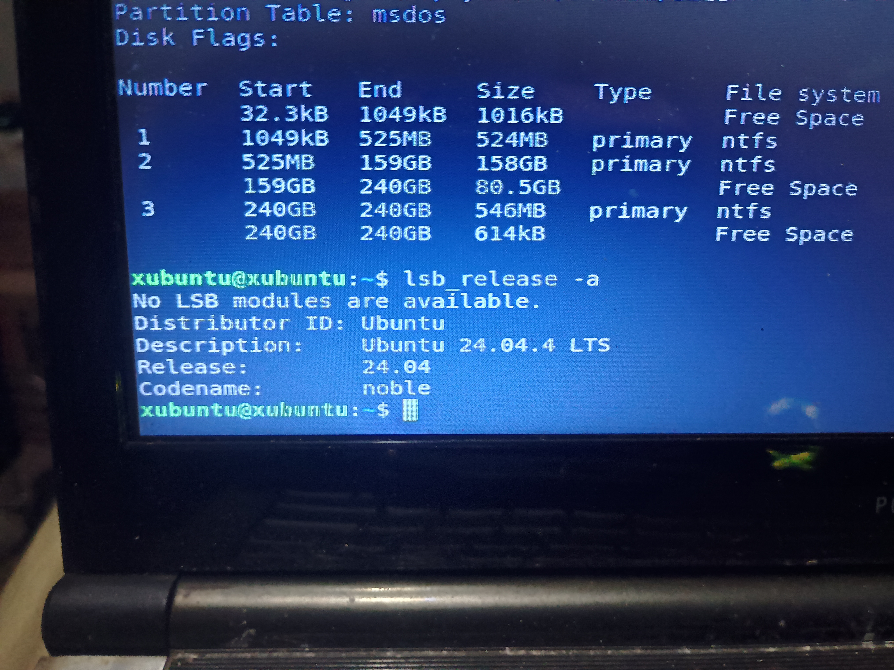
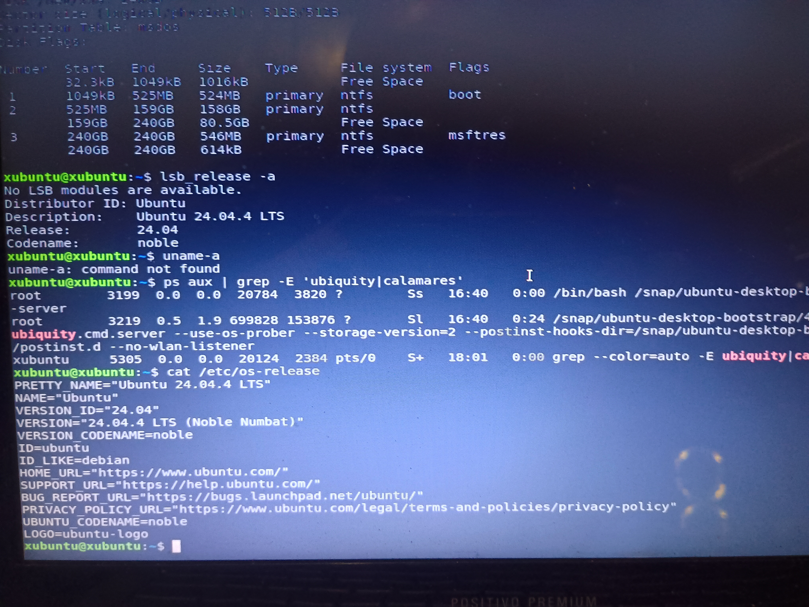

# 05 --- Decisão pelo Xubuntu

## Distribuição escolhida

A distribuição selecionada para o LegacyTechLab é o **Xubuntu 24.04.4
LTS** (base Ubuntu 24.04.4 LTS, codinome Noble Numbat).

## Motivações

A escolha considera:

-   hardware legado;
-   8 GB de RAM;
-   Intel Core i3 de primeira geração;
-   necessidade de uma interface gráfica adequada ao equipamento;
-   objetivo de estudar Linux na prática;
-   acesso ao ecossistema Ubuntu.

## Papel do Xubuntu no projeto

O Xubuntu representa a base inicial do laboratório. Ele não limita a
evolução futura do projeto.

A partir do ambiente Linux, o laboratório poderá receber experimentos
relacionados a:

-   administração de sistemas;
-   redes;
-   infraestrutura;
-   Cloud;
-   cibersegurança;
-   automação;
-   troubleshooting.

## Estado da implementação (atualizado)

-   [x] Mídia USB criada e boot validado no equipamento;
-   [x] Instalador avançou até o particionamento manual;
-   [x] Partição `ext4` (`/dev/sda4`, 80,53 GB) criada com sucesso via
    GParted, validada pelo Linux (montagem/desmontagem sem erro);
-   [x] Causa raiz do erro de particionamento do instalador
    identificada (ver `12-troubleshooting-particionamento-ext4.md`);
-   [x] Contorno funcional encontrado (definir o tamanho da partição em
    **Bytes**, com o valor exato, em vez de MB arredondado);
-   [ ] Instalação do Xubuntu efetivamente concluída;
-   [ ] Boot validado a partir do SSD.

A instalação **ainda não está concluída** — o próximo passo é repetir o
fluxo completo do instalador usando o contorno confirmado e validar até
o fim.

## Evidências visuais

### Versão do sistema Ubuntu/Xubuntu

### Release Noble Numbat

