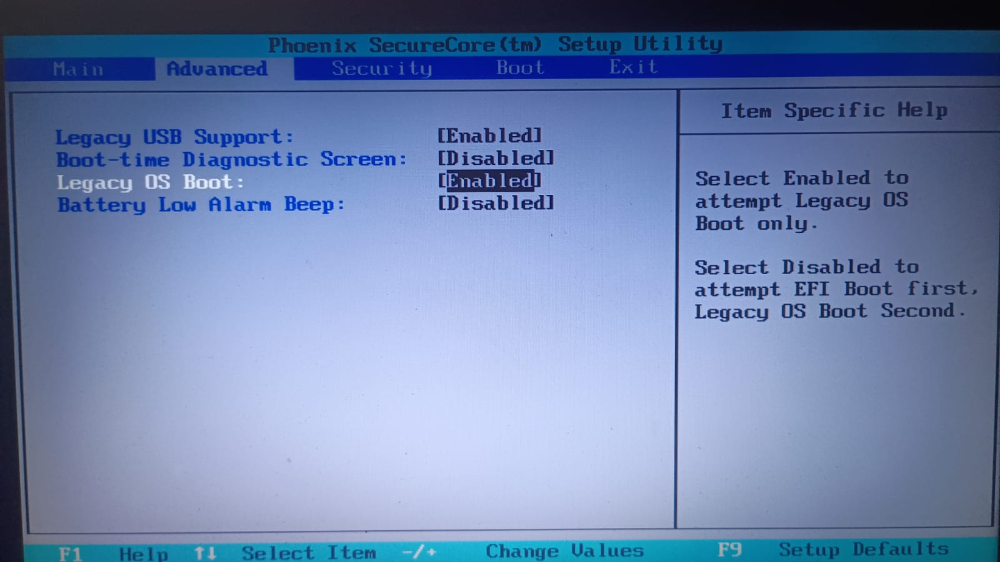

# 06 --- Planejamento do Dual Boot

## Objetivo

Avaliar a possibilidade de instalar o Xubuntu mantendo o sistema Windows
existente.

## Premissa

Antes de qualquer alteração no armazenamento, foi necessário confirmar:

-   qual unidade contém o Windows;
-   qual unidade corresponde ao SSD;
-   qual unidade corresponde ao HD de arquivos pessoais;
-   estrutura atual das partições;
-   espaço disponível;
-   modo de inicialização utilizado pelo equipamento.

## Ambiente identificado

O notebook utiliza:

``` text
Boot: Legacy / BIOS
Tabela de partição: DOS / MBR
```

## Estratégia

A instalação priorizou a preservação dos dados existentes. O espaço
para o Linux foi liberado previamente pelo Windows (redução de
partição), resultando em ~80,53 GB de espaço livre entre `sda2` e
`sda3`.

``` text
Diagnóstico
    ↓
Identificação das unidades
    ↓
Análise das partições
    ↓
Definição do espaço para Linux
    ↓
Criação das partições
    ↓
Instalação
    ↓
Validação do boot
```

## Estado atual

-   A partição `sda4` (ext4, 80,53 GB) já foi criada com sucesso via
    GParted, preservando `sda1`, `sda2` e `sda3` intactas.
-   O instalador Subiquity apresentou três erros distintos durante o
    processo (documentados em
    `12-troubleshooting-particionamento-ext4.md`), o último dos quais
    já teve a causa raiz identificada e um contorno confirmado.
-   A instalação definitiva do Xubuntu no SSD, preservando o dual boot
    com o Windows, ainda não foi concluída.

## Evidências visuais

### Estrutura original do disco


### Configuração Legacy OS Boot



