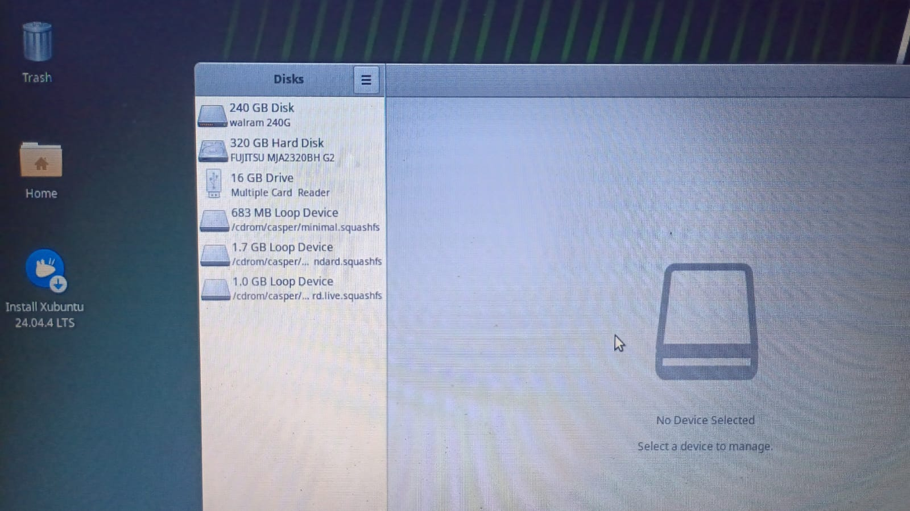
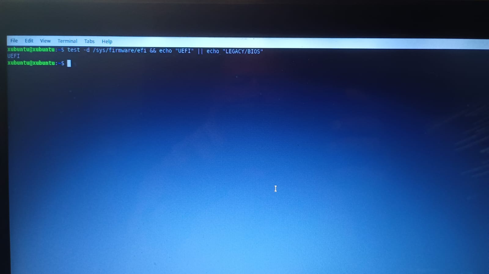
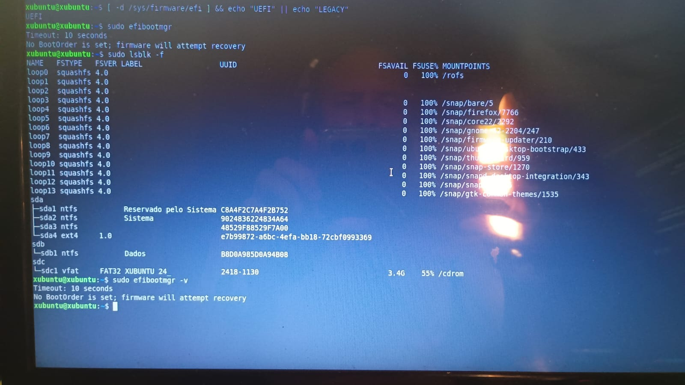
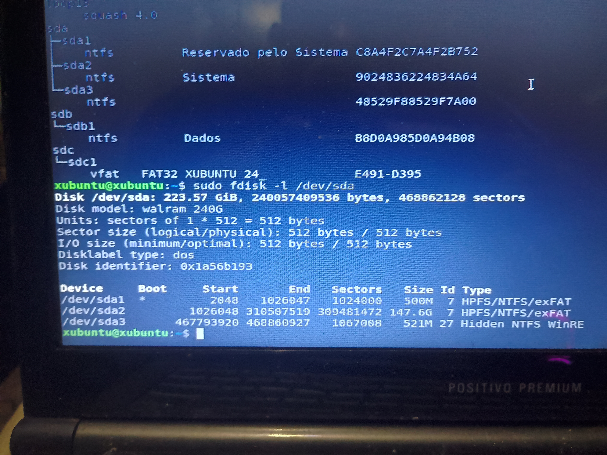
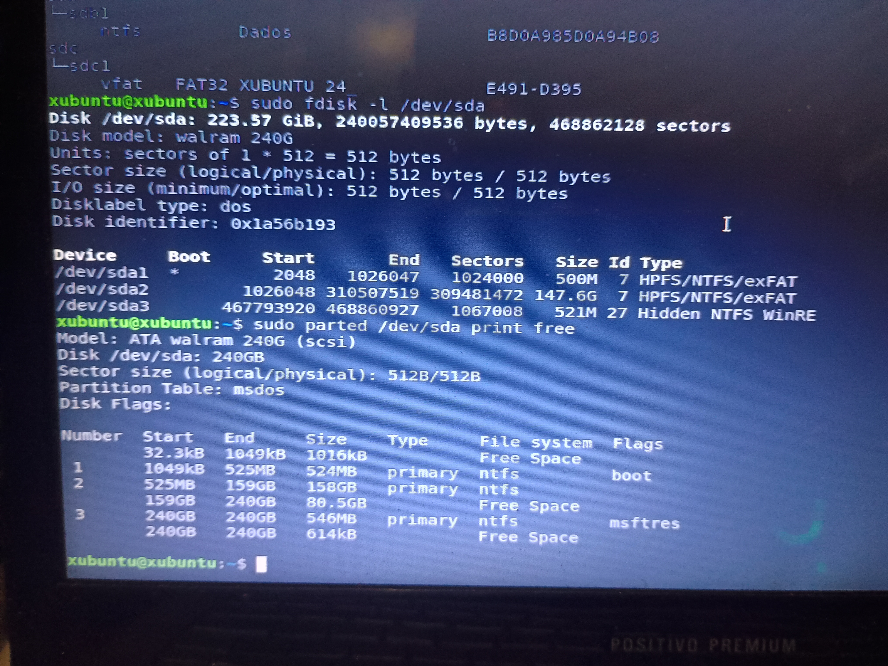

# 07 --- Diagnóstico de Boot e Armazenamento

## Modo de boot

``` text
BIOS: Legacy / Herdado
```

Durante o troubleshooting de boot, a opção **"Legacy OS Boot"** foi
alterada de `Enabled` para `Disabled`, o que estabilizou o carregamento
do GRUB.

## Tabela de partição

``` text
Disklabel type: dos
```

Compatível com uma tabela de partição DOS/MBR.

## Capacidade real (confirmada por `fdisk -l`, `parted print free` e GNOME Disks)

``` text
Capacidade total: 240,06 GB (223,57 GiB / 240.057.409.536 bytes)
Usado (sda1+sda2+sda3): ~159,52 GB
Livre (antes da criação da sda4): 80,53 GB (76.800 MiB)
```

> **Correção:** uma versão anterior deste documento registrava
> "Espaço utilizado: 53,8 GB / Espaço livre: 168 GB / Capacidade: 222
> GB" — esses números não correspondem a nenhuma evidência coletada
> (screenshots, logs ou saídas de terminal) e foram substituídos pelos
> valores acima, confirmados por múltiplas fontes independentes.

## Estrutura de partições identificada

| Partição | Sistema de arquivos | Tamanho | Observação |
|---|---|---|---|
| `/dev/sda1` | NTFS | 524 MB | Reservado pelo Sistema, boot |
| `/dev/sda2` | NTFS | 158,45 GB | Sistema Windows |
| `/dev/sda3` | NTFS | 546,31 MB | Hidden NTFS WinRE |
| `/dev/sda4` | ext4 | 80,53 GB | Criada posteriormente via GParted (ver `12-troubleshooting-particionamento-ext4.md`) |

## Evidência visual

``` text
../screenshots/system/01-gnome-disks-walram-240g-layout.png
../screenshots/partitioning/01-fdisk-lsblk-original-partition-table.png
../screenshots/partitioning/02-fdisk-parted-print-free-original-msdos.png
```

## Importância para a instalação

As informações de boot e particionamento foram fundamentais para evitar
alterações incorretas no armazenamento durante a instalação do Xubuntu.

O problema identificado na criação da partição `ext4` está documentado
separadamente em `12-troubleshooting-particionamento-ext4.md`.

## Evidências visuais

### Estrutura do SSD no GNOME Disks



### Teste do modo de boot



### Validação das partições com lsblk



### Tabela de partições original



### Particionamento MBR e espaço livre



### Espaço livre confirmado pelo parted


