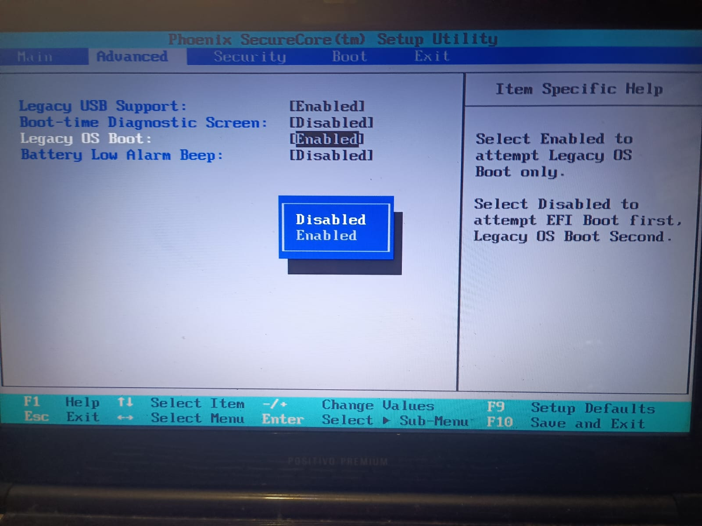

# 09 --- Troubleshooting do Rufus e do GRUB

> Este arquivo consolida o que antes estava dividido entre
> `09-troubleshooting-do-rufus.md` e `10-troubleshooting-do-grub.md` —
> os dois documentavam o mesmo evento (aviso de versão do GRUB durante
> a criação da mídia pelo Rufus). Remova o arquivo
> `10-troubleshooting-do-grub.md` do repositório ao aplicar esta
> atualização.

## Objetivo

Registrar os problemas encontrados durante a criação da mídia USB e o
processo de validação até a obtenção de uma mídia funcional.

## Ocorrência 1 --- Aviso relacionado ao GRUB

O Rufus apresentou a mensagem:

``` text
Esta imagem usa o Grub 2.12, mas este aplicativo inclui somente os arquivos de instalação para Grub 2.14.
```

Evidência: `../screenshots/rufus/01-grub-version-warning.png`

## Ocorrência 2 --- Erro de criação

Também foi registrado:

``` text
Erro: [0xC0030003]
unable to create file [0x00000003]
```

Evidência: `../screenshots/rufus/02-error-0xC0030003.png`

O log bruto está em `../logs/rufus/rufus-error.log`.

## Contexto do equipamento

``` text
Boot: Legacy / BIOS
Tabela: DOS / MBR
```

## Resultado

Apesar dos avisos, a mídia USB foi criada com sucesso e validada no
equipamento físico:

> O Positivo Premium Select 7050 conseguiu iniciar pelo USB.

## Conclusão

O aviso relacionado ao GRUB e o erro `0xC0030003` permanecem
documentados como parte do histórico do projeto, mas **não há
evidência de que representassem uma falha definitiva do processo** — a
mídia funcionou normalmente após as tentativas.

A investigação do GRUB poderá ser retomada caso surjam problemas
durante a instalação ou configuração do bootloader no SSD.

## Aprendizado

O processo reforçou a importância de:

-   registrar erros e preservar logs;
-   manter evidências visuais;
-   testar a mídia no equipamento real;
-   separar problemas de criação da mídia de problemas de instalação.

## Estado

O troubleshooting do Rufus/GRUB está concluído para a etapa atual. O
foco do projeto avançou para o particionamento e instalação do
Xubuntu (ver `12-troubleshooting-particionamento-ext4.md`).

## Evidências visuais

### Configuração de Legacy OS Boot



