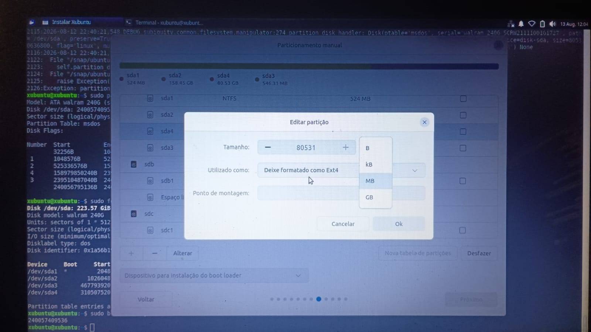
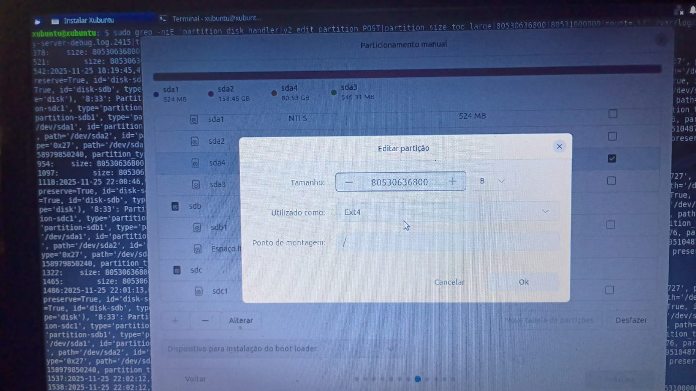
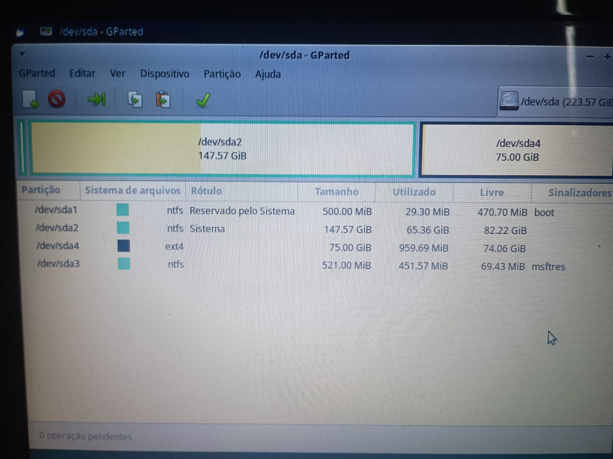
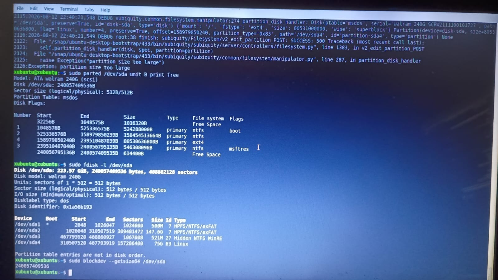
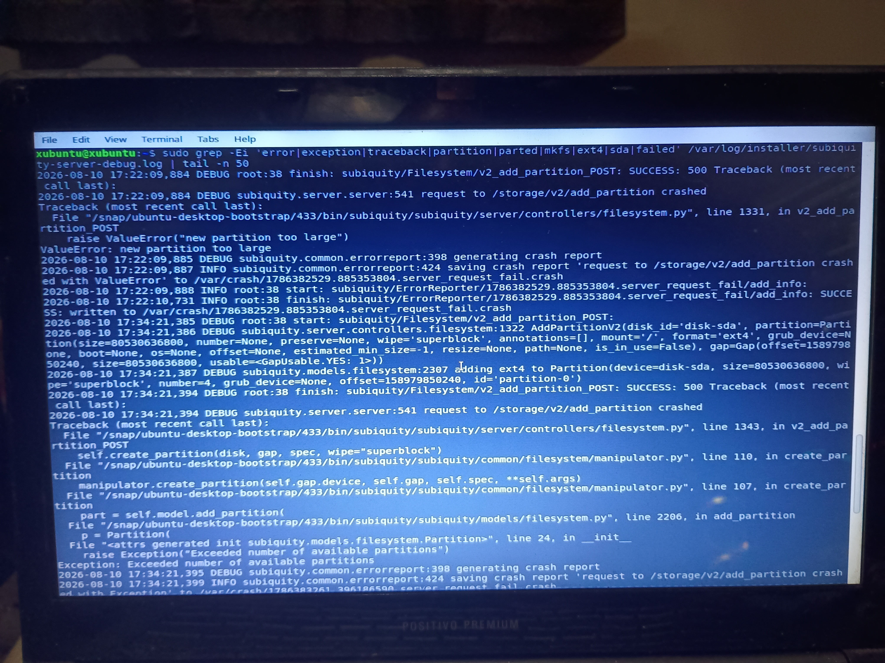
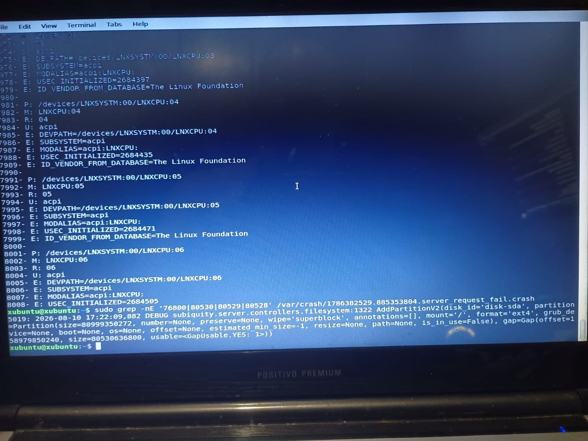

# 12 --- Troubleshooting do Particionamento ext4

## Contexto

Após a criação bem-sucedida da mídia USB e a validação do boot no
Positivo Premium Select 7050, o processo avançou para a instalação do
Xubuntu. Na etapa de particionamento manual, o espaço livre de 80,53 GB
(76.800 MiB) precisava ser convertido em uma partição `ext4` para o
Linux.

Esta investigação passou por **três erros distintos**, todos
relacionados ao cálculo de tamanho feito pelo backend do instalador
(Subiquity), até a causa raiz ser isolada.

## Erro 1 --- `ValueError: new partition too large` (criação direta)

Ao tentar criar a partição pelo próprio particionador gráfico do
Subiquity (tamanho 80531 MB, Ext4, ponto de montagem `/`), o processo
falhava com:

``` text
File ".../subiquity/server/controllers/filesystem.py", line 1331, in v2_add_partition_POST
    raise ValueError("new partition too large")
ValueError: new partition too large
```

O traceback revelou uma discrepância de bytes: o instalador solicitava
`80999350272` bytes contra um gap físico disponível de
`80530636800` bytes — uma diferença de ~447 MiB, indicando
arredondamento incorreto do tamanho pedido pela interface.

Evidência: `../screenshots/troubleshooting/03-debug-log-2415-partition-size-too-large-first-occurrence.png`
(traceback completo), `../screenshots/troubleshooting/02-crash-log-grep-byte-values-confirmed.png`
(confirmação dos valores em bytes via grep no arquivo `.crash`).

## Erro 2 --- `Exception: Exceeded number of available partitions`

Em uma tentativa subsequente de criação direta, o instalador falhou de
forma diferente:

``` text
File ".../subiquity/models/filesystem.py", line 2206, in add_partition
    raise Exception("Exceeded number of available partitions")
```

Causa: a tabela MBR já possui três partições primárias (`sda1`, `sda2`,
`sda3`); o limite de quatro partições primárias em MBR tornava a
criação de uma quarta partição, pela rota usada, um caso-limite mal
tratado pelo instalador.

Evidência: `../screenshots/troubleshooting/01-subiquity-log-exceeded-partitions-exception.png`

## Solução alternativa --- Criação via GParted

Diante da falha do particionador do instalador, a partição foi criada
manualmente pelo **GParted**, dentro do próprio ambiente Live:

-   Espaço não alocado de 75,00 GiB (76.800 MiB) identificado;
-   Partição primária criada com sistema de arquivos `ext4`,
    alinhamento em MiB;
-   Operação aplicada com sucesso em 4 segundos;
-   Resultado: `/dev/sda4` --- ext4 --- 75,00 GiB (80.530.636.800
    bytes / 80,53 GB).

A partição foi validada pelo Linux via montagem e desmontagem manual
(`mount`/`umount`), sem erros, e reconhecida pelo instalador na
sequência.

Evidência: pasta `../screenshots/partitioning/` (04 a 11).

## Erro 3 --- `Exception: partition size too large` (edição de partição existente)

Com a `sda4` já criada e reconhecida, o problema persistente era: ao
selecionar a partição no instalador, definir `Utilizado como: Ext4` e
`Ponto de montagem: /`, e clicar em OK, a configuração **não era
salva** --- a tabela voltava a mostrar a partição sem ponto de
montagem, e a mensagem "System program problem detected" aparecia.

A investigação do arquivo `subiquity-server-debug.log.2415` revelou a
causa:

``` text
File ".../subiquity/server/controllers/filesystem.py", line 1383, in v2_edit_partition_POST
    self.partition_disk_handler(disk, spec, partition=partition)
File ".../subiquity/common/filesystem/manipulator.py", line 287, in partition_disk_handler
    raise Exception("partition size too large")
Exception: partition size too large
```

Diferente dos dois primeiros erros (que ocorrem ao **criar** uma
partição), este ocorre no fluxo de **editar** uma partição já
existente (`v2_edit_partition_POST`) --- exatamente o fluxo usado para
associar o ponto de montagem `/` à `sda4`.

Esse erro foi reproduzido em pelo menos três tentativas diferentes
(datas/horários confirmados no log: uma ocorrência histórica e duas em
12--13/08/2026), sempre com o mesmo padrão: o campo "Tamanho" no
diálogo "Editar partição", quando preenchido em **MB**, gera um valor
em bytes (`80531000000`) ligeiramente **maior** que o tamanho real da
partição (`80530636800` bytes) --- e o Subiquity rejeita qualquer
tamanho que ultrapasse o tamanho físico real, mesmo por poucos bytes.

Evidência: pasta `../screenshots/troubleshooting/` (09, 10, 12, 13, 14,
15) e `../screenshots/installation/` (01, 02, 03, 07, 08).

## Causa raiz e contorno confirmado

**Causa raiz:** o campo de tamanho da interface do Subiquity, em
unidade MB, arredonda o valor para cima ao converter para bytes,
ultrapassando o tamanho físico exato da partição. O backend do
Subiquity rejeita a operação de edição sempre que o tamanho solicitado
excede --- mesmo minimamente --- o tamanho real.

**Contorno:** ao trocar a unidade do campo "Tamanho" de MB para
**Bytes (B)** e inserir o valor exato (`80530636800`), a operação foi
aceita:

``` text
DEBUG root:38 finish: subiquity/Filesystem/v2_edit_partition_POST: SUCCESS: 200 {"status": "DONE", "error_report": null, ...}
```

Isso foi confirmado em `../screenshots/troubleshooting/05-debug-log-2415-BREAKTHROUGH-success-200-done-exact-bytes.png`.
Uma tentativa posterior, usando novamente o valor arredondado em MB,
voltou a falhar com o mesmo erro (`../screenshots/troubleshooting/06-debug-log-2415-third-attempt-fails-rounded-mb-value.png`),
confirmando que a unidade Bytes com o valor exato é o que resolve o
problema.

Evidência: `../screenshots/installation/01-edit-partition-unit-dropdown-b-kb-mb-gb.png`
(seleção da unidade Bytes),
`../screenshots/installation/02-edit-partition-exact-bytes-80530636800-attempt.png`
(tentativa com o valor exato).

## Regra de segurança

Nenhuma alteração destrutiva no armazenamento foi realizada durante a
investigação. `sda1`, `sda2` e `sda3` permaneceram intactas em todas as
etapas.

## Estado

**Causa raiz identificada e contorno confirmado.** A instalação do
Xubuntu ainda não foi concluída --- o próximo passo é repetir o fluxo
completo do instalador usando o contorno (tamanho em Bytes exatos) até
a conclusão efetiva da instalação, seguida da validação de boot pelo
SSD.

## Evidências visuais

### Unidades disponíveis no particionador



### Tentativa com valor exato em bytes



### Partição ext4 criada no GParted



### sda4 confirmada pelo parted/fdisk



### Exceção de número de partições



### Valores em bytes confirmados no log



### Breakthrough: valor exato aceito


