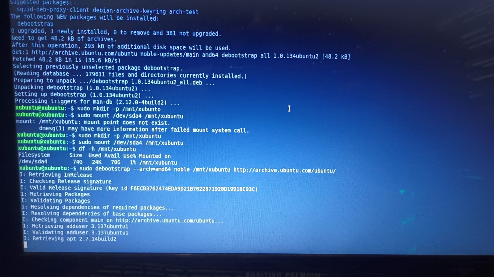
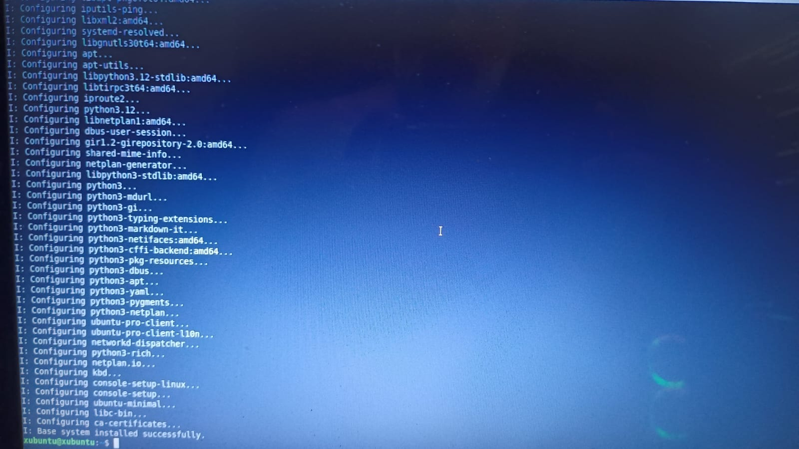
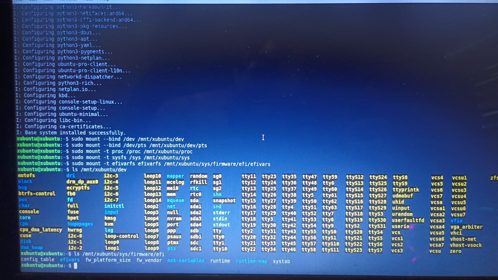
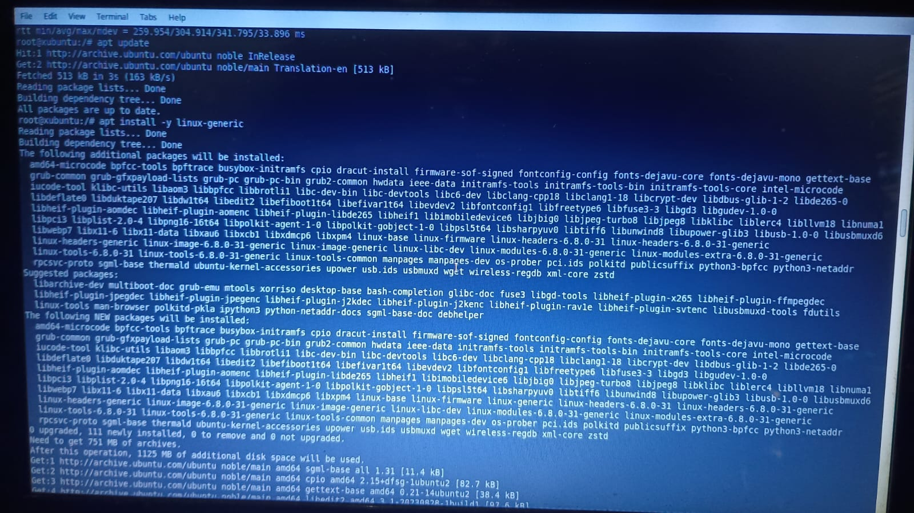
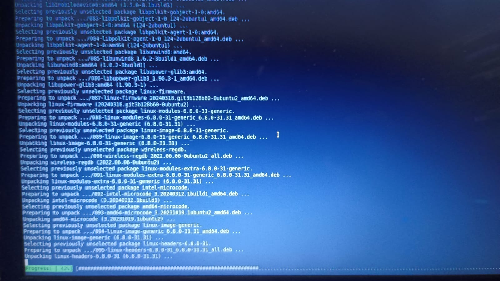
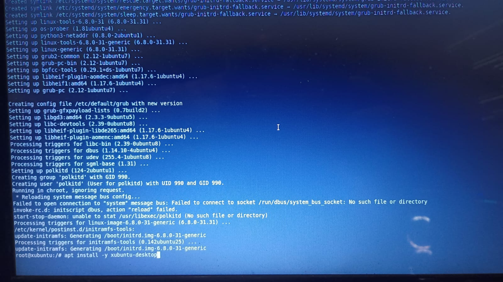
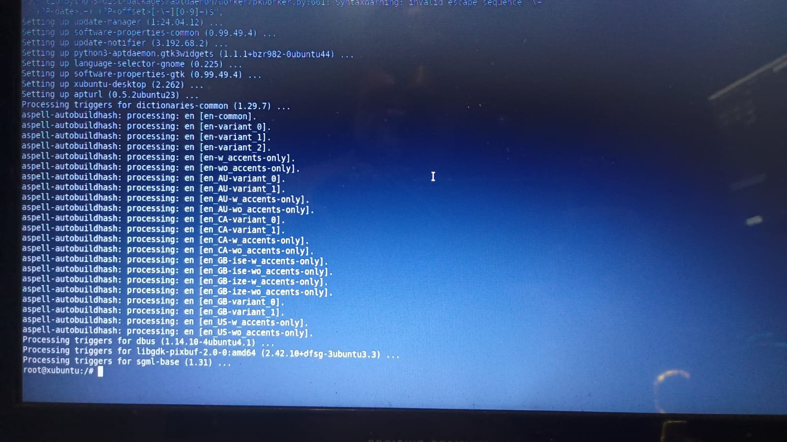
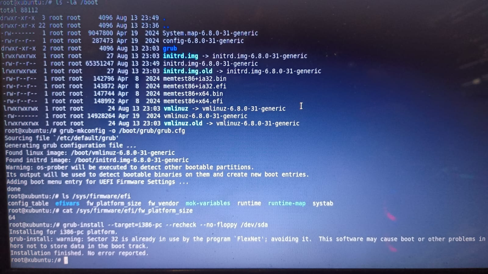
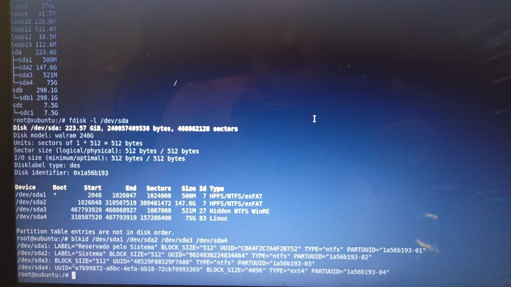

# 13 --- Instalação Manual via debootstrap (rota alternativa ao Subiquity)

## Contexto

Diante da falha persistente do instalador gráfico (Subiquity) ao tentar
associar o ponto de montagem `/` à partição `sda4` (ver
`12-troubleshooting-particionamento-ext4.md`), o projeto adotou uma
rota de instalação totalmente manual, via `debootstrap` + `chroot` --
uma técnica clássica de instalação Debian/Ubuntu que não depende do
instalador gráfico.

## Preparação do ambiente Live

- Corrigida a resolução de DNS no ambiente Live (falhas iniciais de
  `apt update` por "Temporary failure resolving").
- Instalado o pacote `debootstrap`.
- `/dev/sda4` montada manualmente em `/mnt/xubuntu` (confirmando 74G
  disponíveis).

Evidência: `../screenshots/manual-install/01` a `04`.

## Instalação do sistema base

```
sudo debootstrap --arch=amd64 noble /mnt/xubuntu http://archive.ubuntu.com/ubuntu/
```

Concluído com sucesso: `I: Base system installed successfully.`

Evidência: `../screenshots/manual-install/05-06`.

## Preparação do chroot

Bind mounts realizados: `/dev`, `/dev/pts`, `/proc`, `/sys`,
`efivarfs` (`/sys/firmware/efi/efivars`) --- a montagem bem-sucedida do
`efivarfs` reforça que o firmware do equipamento expõe uma interface
UEFI ativa nesta sessão, mesmo com o disco em MBR.

Em seguida, `sudo chroot /mnt/xubuntu /bin/bash`.

Evidência: `../screenshots/manual-install/07`.

## Configuração básica dentro do chroot

- Hostname e `/etc/hosts` configurados via heredoc.
  > **Atenção registrada nesta etapa:** o comando de hostname foi
  > digitado sem o operador de redirecionamento (`echo "legacytechlab"
  > /etc/hostname`, sem `>`), e o `/etc/hosts` foi gravado com um typo
  > (`1127.0.1.1` em vez de `127.0.1.1`). Ambos precisam ser
  > verificados/corrigidos antes do primeiro boot real.
- `/etc/resolv.conf` reconfigurado (`nameserver 8.8.8.8` /
  `1.1.1.1`), com teste de DNS confirmado (`ping archive.ubuntu.com`
  bem-sucedido após corrigir um typo de digitação --- "arquive" em vez
  de "archive").

Evidência: `../screenshots/manual-install/08-10`.

## Kernel e ambiente gráfico

- `apt install -y linux-generic` --- kernel `6.8.0-31-generic`
  instalado.
- `apt install -y xubuntu-desktop` --- falhou na primeira tentativa
  (`E: Unable to locate package xubuntu-desktop`) porque o
  `/etc/apt/sources.list` só continha o componente `main`. Corrigido
  adicionando `restricted universe multiverse` e refeito o `apt
  update`.
- Confirmado via `dpkg -l`: `xubuntu-desktop` e
  `xubuntu-desktop-minimal` (2.262) instalados com sucesso.

Evidência: `../screenshots/manual-install/11-20`.

## GRUB

- Verificado via `apt-cache policy`: `grub-pc` instalado
  (2.12-1ubuntu7), `grub-efi-amd64` disponível mas **não** instalado.
  Decisão tomada pela rota **i386-pc (Legacy/BIOS)**, coerente com a
  tabela de partições MBR do disco.
- `grub-mkconfig -o /boot/grub/grub.cfg` --- gerado com sucesso,
  detectou kernel e initrd, e adicionou uma entrada de menu para
  "UEFI Firmware Settings" (o firmware expõe as duas rotas, mas a
  instalação seguiu por Legacy).
- `grub-install --target=i386-pc --recheck --no-floppy /dev/sda` ---
  **`Installation finished. No error reported.`** Um aviso sobre o
  setor 32 já estar em uso por um programa "FlexNet" (marcação
  residual comum em notebooks com Windows OEM) foi emitido, mas o
  GRUB evitou esse setor automaticamente, sem impacto registrado.

Evidência: `../screenshots/manual-install/21-24`.

## Saída do chroot e desmontagem

- `grep -v '^#' /etc/fstab` retornou **vazio** --- o `/etc/fstab` não
  possui nenhuma entrada de montagem configurada. Isso é esperado em
  uma instalação via `debootstrap` (o arquivo não é gerado
  automaticamente), mas **precisa ser corrigido antes do primeiro
  boot real**, com uma entrada para a partição raiz, por exemplo:
  ```
  UUID=e7b99872-a6bc-4efa-bb18-72cbf0993369  /  ext4  defaults  0  1
  ```
- `exit` do chroot.
- Desmontagem: as primeiras tentativas usaram caminhos incorretos
  (`/mnt/dev`, `/mnt/sys` etc. em vez de `/mnt/xubuntu/dev`,
  `/mnt/xubuntu/sys`) e falharam com `not found`. O comando correto,
  `sudo umount -R /mnt/xubuntu`, teve sucesso --- confirmado por
  `mount | grep /mnt` (saída vazia) e `lsblk -f` (estrutura de
  partições intacta).

Evidência: `../screenshots/manual-install/25-26`.

## Estado no encerramento desta etapa (confirmado por evidência nesta sessão)

- [x] Sistema base instalado via `debootstrap`;
- [x] Kernel e `xubuntu-desktop` instalados;
- [x] `grub-install` executado com sucesso (i386-pc / Legacy);
- [x] Chroot desmontado com sucesso, sem erros;
- [ ] `/etc/fstab` --- **ainda vazio, precisa ser preenchido**;
- [ ] Hostname e `/etc/hosts` --- **precisam ser conferidos** (typo
  registrado);
- [ ] Boot real pelo SSD (sem o pendrive) --- **ainda não validado
  nesta sessão**.

> Este documento reflete apenas o que foi comprovado por evidência
> visual coletada nesta sessão. Etapas posteriores (validação de
> boot, dual boot funcional, correções finais) devem ser documentadas
> à parte, com suas próprias evidências, antes de serem incorporadas
> aqui.

## Evidências visuais

### Início do debootstrap



### Sistema base instalado



### Bind mounts para o chroot



### Instalação do kernel



### Pacotes do kernel



### Initramfs gerado



### Xubuntu Desktop instalado



### GRUB i386-pc instalado



### UUIDs das partições confirmados



