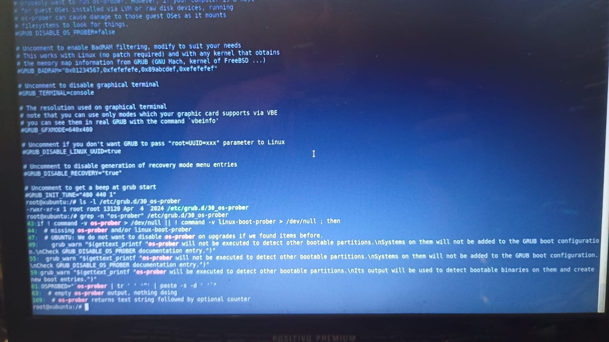
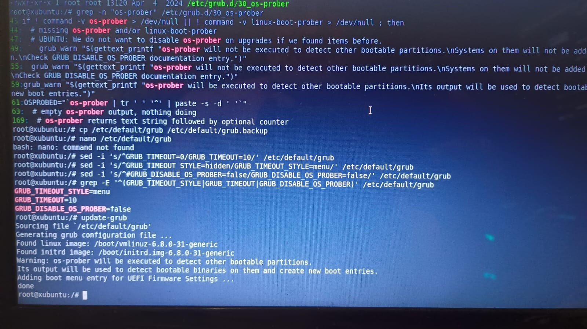
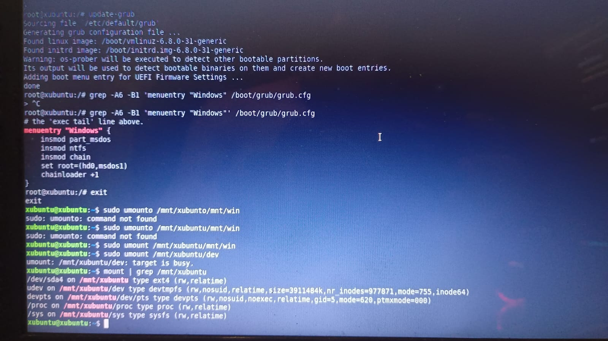
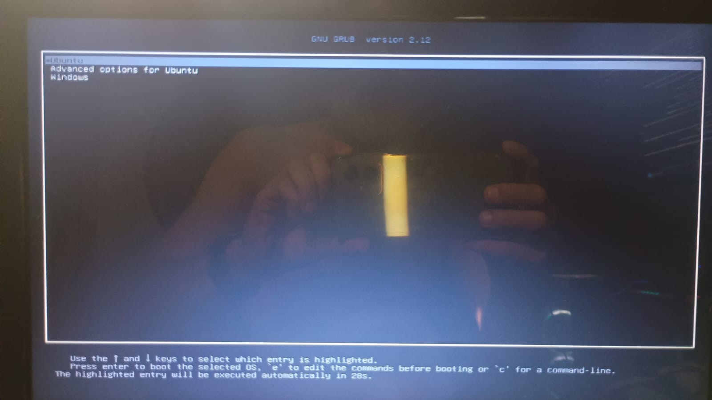
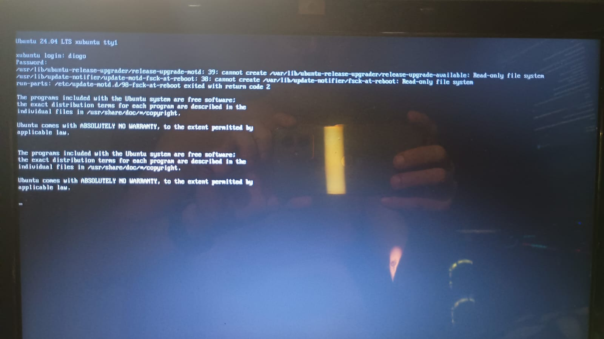
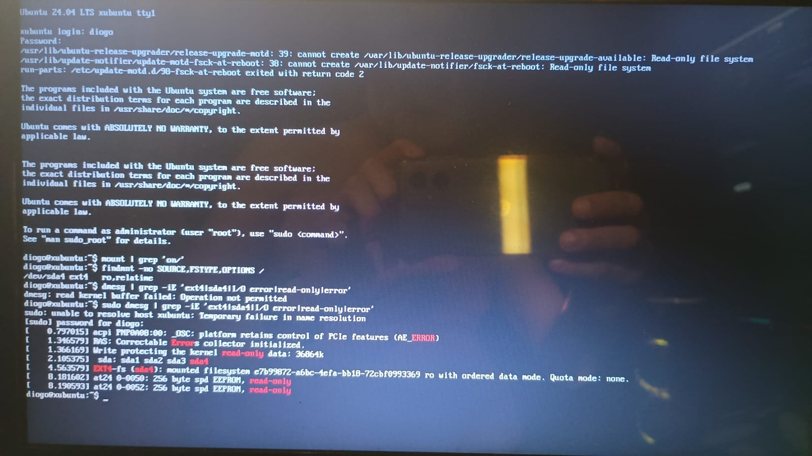
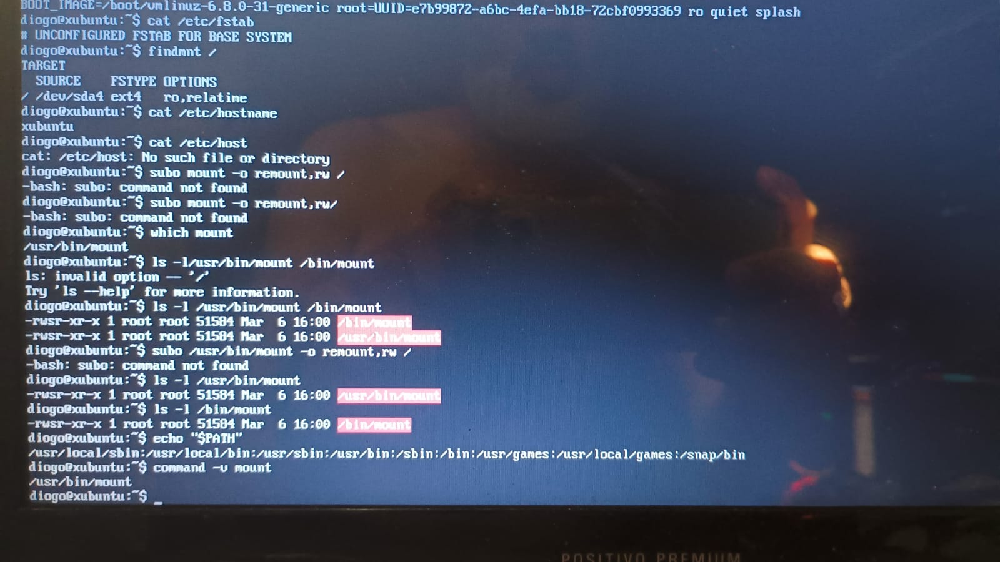
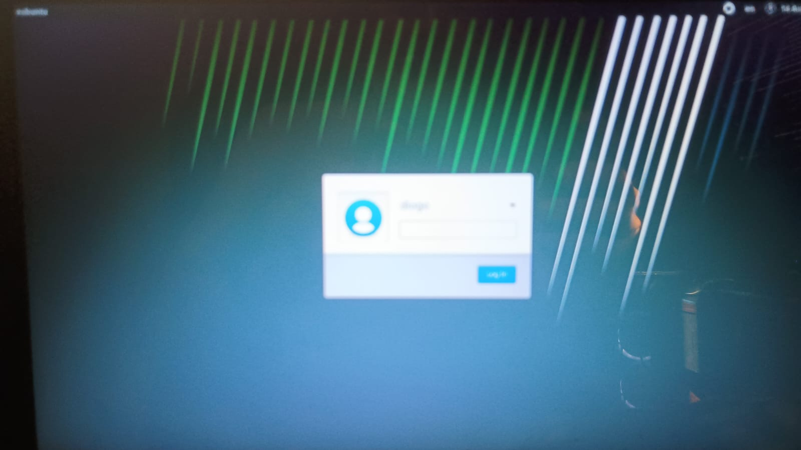
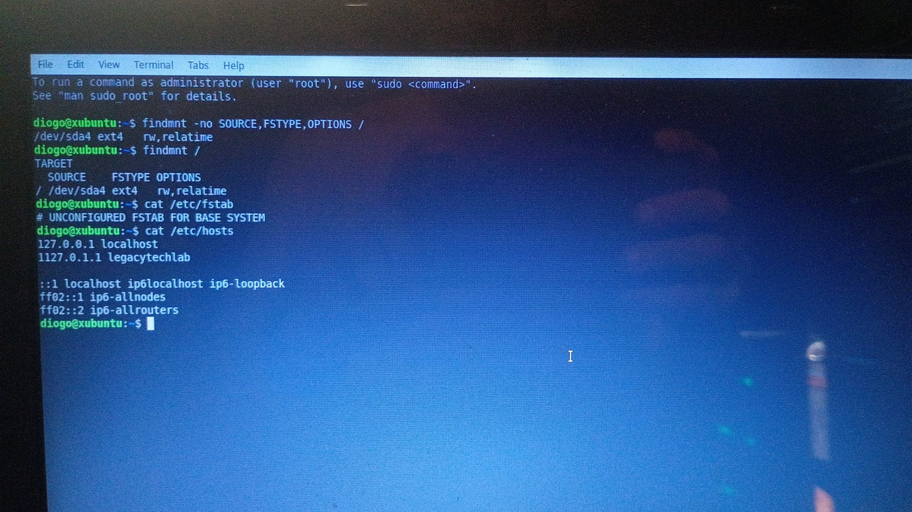

# 14 --- Configuração Final e Validação do Primeiro Boot Real

## Contexto

Continuação de `13-instalacao-manual-debootstrap.md`. Após o
`grub-install` bem-sucedido, foi feita uma nova entrada no chroot para
configurar usuário, GRUB e testar o primeiro boot real (sem o
pendrive).

## Configuração do usuário

- Usuário `diogo` criado.
- `usermod -aG adm,cdrom,sudo,dip,plugdev,lxd,users,netdev diogo` ---
  o grupo `lxd` **não existia** neste sistema (`usermod: group 'lxd'
  does not exist`), então o comando foi refeito sem ele.
- Grupos finais confirmados via `id diogo`: `adm`, `cdrom`, `sudo`,
  `dip`, `plugdev`, `users`, `netdev`.
- `/home/diogo` confirmado criado.

Evidência: `../screenshots/manual-install/27.png`.

## LightDM

- `systemctl enable lightdm` --- retornou aviso de que a unidade não
  tem config de instalação via systemctl (comportamento esperado para
  o pacote `lightdm`, que usa integração SysV).
- Confirmado via `ls -l`: `/etc/systemd/system/display-manager.service
  -> /lib/systemd/system/lightdm.service`.

Evidência: `../screenshots/manual-install/27-28.png`.

## GRUB --- configuração e entrada manual do Windows

- `os-prober` confirmado instalado (`dpkg -l`).
- Estrutura de partições e UUIDs reconferidos via `fdisk -l` e
  `blkid` --- todos batendo com os valores já documentados
  anteriormente (`sda4` UUID `e7b99872-a6bc-4efa-bb18-72cbf0993369`).
- Módulos GRUB necessários para o chainload do Windows confirmados em
  `/boot/grub/i386-pc`: `chain.mod`, `ntfs.mod`, `msdospart.mod`,
  `normal.mod`.
- `/etc/default/grub` editado via `sed` (o `nano` não estava
  disponível no ambiente): `GRUB_TIMEOUT=10`,
  `GRUB_TIMEOUT_STYLE=menu`, `GRUB_DISABLE_OS_PROBER=false`.
- `update-grub` executado --- **o `os-prober` não detectou o Windows
  automaticamente** (nenhuma linha "Found Windows Boot Manager" no
  log), confirmando a necessidade da entrada manual.
- Entrada manual adicionada em `/etc/grub.d/40_custom`:
  ```
  menuentry "Windows" {
      insmod part_msdos
      insmod ntfs
      insmod chain
      set root=(hd0,msdos1)
      chainloader +1
  }
  ```
- Confirmada presente no `/boot/grub/grub.cfg` gerado, via `grep`.

Evidência: `../screenshots/manual-install/29-37.png`.

## Primeiro boot real (sem o pendrive)

### Tela do GRUB

Boot real do equipamento exibiu o menu do GRUB (GNU GRUB versão 2.12)
com as entradas **Ubuntu**, **Advanced options for Ubuntu** e
**Windows** --- confirmando visualmente que a configuração de dual
boot foi aplicada com sucesso.

Evidência: `../screenshots/validation/01-grub-menu-real-boot-ubuntu-windows-entries.png`.

### Primeiro login (modo texto)

O primeiro boot do Xubuntu caiu em modo texto (`tty1`), sem ambiente
gráfico. Login como `diogo` bem-sucedido, mas com erros:

```
/usr/lib/ubuntu-release-upgrader/release-upgrade-motd: cannot create ...: Read-only file system
/usr/lib/update-notifier/update-motd-fsck-at-reboot: cannot create ...: Read-only file system
```

Investigação confirmou a raiz montada como somente leitura:

```
$ findmnt -no SOURCE,FSTYPE,OPTIONS /
/dev/sda4 ext4 ro,relatime
```

```
dmesg: EXT4-fs (sda4): mounted filesystem e7b99872-a6bc-4efa-bb18-72cbf0993369 ro with ordered data mode.
```

Também foi reproduzido o aviso:

```
sudo: unable to resolve host xubuntu: Temporary failure in name resolution
```

Evidência: `../screenshots/validation/02-03.png`.

### Diagnóstico das causas

- `cat /etc/fstab` --- ainda `# UNCONFIGURED FSTAB FOR BASE SYSTEM`
  (o arquivo nunca foi preenchido durante a instalação via
  `debootstrap`). O parâmetro `ro` vem do próprio `cmdline` do kernel
  (`root=UUID=... ro quiet splash`) --- comportamento padrão do
  Linux, que normalmente é revertido por uma entrada `rw` no
  `/etc/fstab` durante o boot; sem essa entrada, a raiz permanece
  somente leitura.
- `cat /etc/hostname` --- retornou `xubuntu` (o padrão herdado do
  `debootstrap`), **não** `legacytechlab` como foi tentado gravar
  durante a configuração no chroot (ver observação já registrada em
  `13-instalacao-manual-debootstrap.md` sobre o comando `echo` sem
  redirecionamento `>`).
- `cat /etc/host` (nome incorreto, sem "s") --- erro de digitação do
  operador, não reflete o estado real do `/etc/hosts`.
- Tentativas de remontar como leitura-escrita usando `subo` (typo de
  `sudo`) falharam repetidamente até o comando correto ser usado.

Evidência: `../screenshots/validation/04-fstab-unconfigured-hostname-xubuntu-remount-attempts.png`.

### Ambiente gráfico

Login gráfico via LightDM confirmado funcional --- tela de login real
fotografada, exibindo o hostname `xubuntu` e o usuário `diogo`.

Evidência: `../screenshots/validation/05-lightdm-graphical-login-screen-real.png`.

### Última foto desta sessão

```
$ findmnt -no SOURCE,FSTYPE,OPTIONS /
/dev/sda4 ext4 rw,relatime
$ cat /etc/fstab
# UNCONFIGURED FSTAB FOR BASE SYSTEM
$ cat /etc/hosts
127.0.0.1 localhost
1127.0.1.1 legacytechlab
...
```

Neste ponto, a partição já aparece montada como leitura-escrita (`rw`)
--- provavelmente por um remount manual bem-sucedido não fotografado
--- mas **`/etc/fstab` continua vazio e `/etc/hosts` continua com o
typo** `1127.0.1.1`. Esta é a última evidência fotográfica desta
sessão.

Evidência: `../screenshots/validation/06-findmnt-now-rw-fstab-hosts-still-unfixed-at-this-photo.png`.

## ⚠️ Nota de integridade da documentação

O arquivo de transferência de contexto de 14/08 relata que, após este
ponto, `/etc/fstab` e `/etc/hosts` foram corrigidos definitivamente
(com `UUID=e7b99872-... / ext4 defaults 0 1` e `127.0.1.1 xubuntu`,
respectivamente), validados com `getent hosts xubuntu` e `sudo mount
-a`, e que o sistema foi reiniciado com sucesso mantendo o
comportamento correto.

**Essas correções finais não estão fotografadas nas 18 imagens
recebidas nesta sessão** --- a última foto disponível ainda mostra o
estado anterior à correção. O relato do `.txt` é mantido aqui como
histórico do que foi reportado, mas **não deve ser tratado como
comprovado por evidência visual até que as fotos correspondentes
sejam anexadas ao projeto**, seguindo a mesma regra já aplicada ao
restante da documentação.

## Estado real confirmado por evidência nesta sessão

- [x] Usuário `diogo` e grupos configurados;
- [x] LightDM habilitado e funcional (foto real da tela de login);
- [x] GRUB configurado com timeout visível e entrada manual do
  Windows;
- [x] Boot real testado --- menu do GRUB funcional, com as duas
  entradas (foto real);
- [x] Xubuntu inicializa e permite login (modo texto e gráfico);
- [x] Causa da montagem somente-leitura identificada
  (`/etc/fstab` vazio);
- [ ] Correção definitiva de `/etc/fstab` --- **relatada no `.txt`,
  sem foto correspondente ainda**;
- [ ] Correção definitiva de `/etc/hosts` e hostname --- **relatada
  no `.txt`, sem foto correspondente ainda**;
- [ ] Validação final pós-reboot com tudo corrigido --- **relatada no
  `.txt`, sem foto correspondente ainda**.


## Atualização posterior — fechamento da validação

Após a última evidência fotográfica registrada no documento original, foram realizadas as correções finais reportadas no histórico do projeto:

- `/etc/fstab` foi preenchido com a UUID de `/dev/sda4`:

```text
UUID=e7b99872-a6bc-4efa-bb18-72cbf0993369 / ext4 defaults 0 1
```

- `/etc/hosts` foi corrigido para:

```text
127.0.0.1 localhost
127.0.1.1 xubuntu
```

- `getent hosts xubuntu` retornou corretamente o hostname.
- `sudo mount -a` foi executado sem erro.
- `findmnt -no SOURCE,FSTYPE,OPTIONS /` confirmou `/dev/sda4 ext4 rw,relatime`.
- O Xubuntu foi reiniciado e voltou em modo gráfico.
- Windows e Xubuntu foram testados pelo menu do GRUB e permaneceram funcionais.

**Essas correções finais foram confirmadas no histórico operacional da sessão, mas não possuem screenshots correspondentes no pacote original do Claude.** Elas devem ser consideradas parte do estado final do projeto, enquanto as imagens mantêm o papel de evidência histórica das etapas anteriores.

## Evidências visuais

### Investigação do os-prober



### os-prober sem detecção automática do Windows



### Entrada manual do Windows no GRUB



### Menu GRUB no boot real



### Primeiro login no TTY



### Diagnóstico da montagem read-only



### fstab inicialmente não configurado



### Login gráfico do Xubuntu



### Raiz posteriormente montada em rw



