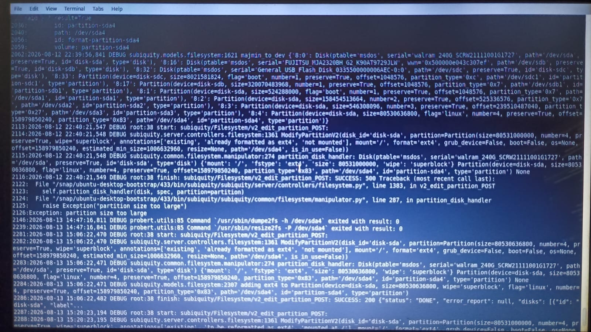

# 15 — Lições Aprendidas

## Troubleshooting baseado em evidências

O projeto mostrou a importância de validar cada hipótese com evidências de baixo nível, especialmente quando o instalador gráfico apresenta comportamento inconsistente.

## Ferramentas de recuperação

Quando o fluxo gráfico deixou de ser confiável, `debootstrap`, `chroot`, `mount`, `fstab`, `blkid`, `parted` e GRUB permitiram concluir a instalação.

## Documentação

Screenshots devem comprovar uma decisão, um problema ou um resultado. Capturas sequenciais que não acrescentam informação devem ficar fora da documentação principal, mas podem ser preservadas em um arquivo histórico.

## Estado atual

A instalação foi concluída e validada posteriormente: Windows e Xubuntu iniciam pelo GRUB, a raiz `/dev/sda4` está em `rw`, o `fstab` foi corrigido e o hostname foi validado.

## Evidências visuais

### Evidência do breakthrough

### Validação do dual boot

### Validação do ambiente gráfico

